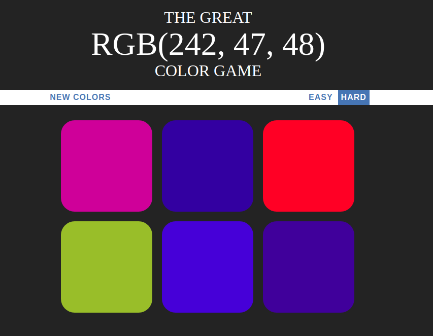
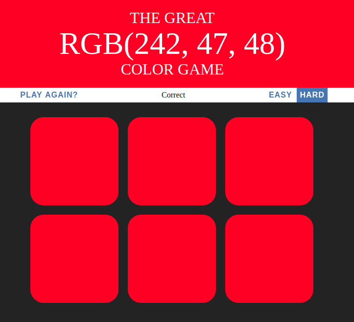

# The Great RGB Color Game

Have fun guessing what color matchs a given RGB(red, green, blue) code vs
squares displayed.

Red, green, blue channels go from 0 to 255. 
Example rgb(0, 255, 0) is a full green color.

You are able to select new colors, and set easy/hard mode. 
Easy mode - 3 squares will be displayed. 
Hard mode - 6 squares will be displayed.

## Getting Started

### Prerequisites

### Installing

## Running the tests

### Break down into end to end tests

### And coding style tests

## Deployment

## Built With

* [HTML]
* [CSS]
* [JAVASCRIPT]

## Contributing

## Versioning

## Authors

* **Cristian Garcia** 

See also the list of [contributors](https://github.com/criscros-garcia/guessingGame/graphs/contributors) who participated in this project.

## License

## Acknowledgments

* Exercise from "The Web developer BootCamp" by Colt Stelle
https://github.com/Colt

